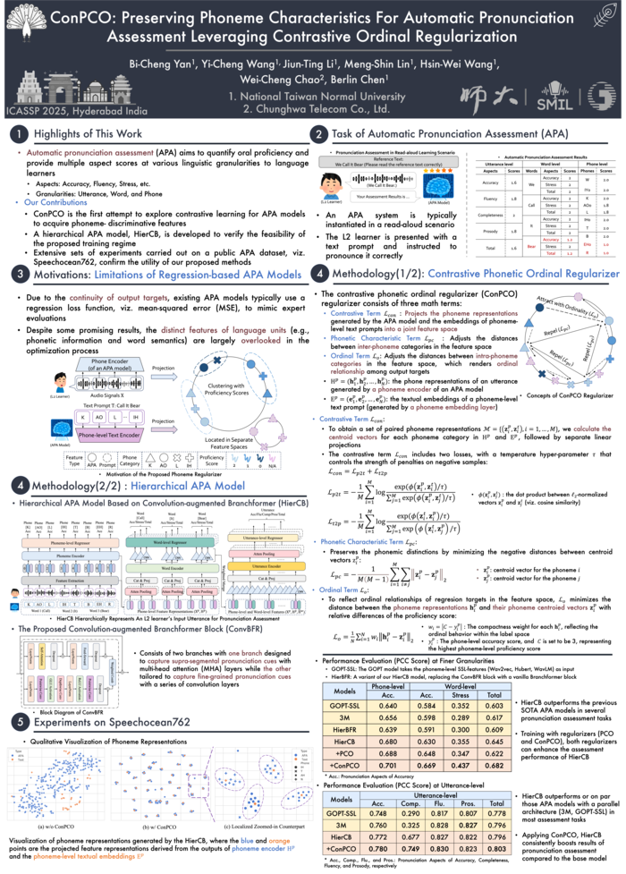

# ConPCO: Preserving Phoneme Characteristics For Automatic Pronunciation Assessment Leveraging Contrastive Ordinal Regularization

This is the codebase of the paper [ConPCO: Preserving Phoneme Characteristics For Automatic Pronunciation Assessment Leveraging Contrastive Ordinal Regularization](https://ieeexplore.ieee.org/document/10890778), which is published at IEEE ICASSP 2025.

> We appreciate [GOPT](https://github.com/YuanGongND/gopt) (Gong et al., 2022) who provides a great template and code work. We follow their design and modify it as our edition.

> We also appreciate [SpeechOcean762](https://github.com/jimbozhang/speechocean762) (Junbo et al., 2021) and [gop-ft](https://github.com/JazminVidal/gop-ft) (Marcelo et al., 2022) who provides the sample codes on GOP implementation in Python codebase with PyKaldi APIs.

> We also apprecitate [EPSNet](https://github.com/espnet/espnet) (Watanabe et al., 2018) provide the implementation of multi-head attention module.

> Finally, we appreciate the implementatoin of [ordinal entropy](https://github.com/needylove/OrdinalEntropy) (Shihao et al., 2023).

In this work, we propose ConPCO, a contrastive phonemic ordinal regularizer tailored for regression-based pronunciation assessment models. The proposed regularizer generates more phoneme-discriminative features by considering the ordinal relationships among regression targets.
ConPCO first aligns phoneme representations of an APA model with textual embeddings of phonetic transcriptions via contrastive learning. Afterward, it retains phoneme characteristics by regulating distances between inter- and intra-phoneme categories in the feature space, while allowing for ordinal relationships among the output targets (phone-level accuracy).



## Dataset
SpeechOcean762 (licenced with CC BY 4.0), an open source dataset is used in this work. Please download it from [https://www.openslr.org/101](https://www.openslr.org/101).

## Data
In this work, we utilize the following features:

 - GOP (Goodness-of-Pronunciation) Features
 - Energy
 - Duration
 - Self-Supervised Learning Audio Features (e.g., Wav2vec 2.0, HuBERT, WavLM)

These features have been compressed and are available for [download](#). After downloading, extract the files and place them in the `data` directory.

To understand how the GOP features are obtained, refer to the [gop_speechocean762](https://github.com/kaldi-asr/kaldi/tree/master/egs/gop_speechocean762) recipe in the Kaldi project. Additionally, the [GOPT](https://github.com/YuanGongND/gopt) (Gong et al., 2022) GitHub repository provides a comprehensive tutorial on performing inference with your own data.

## Citing

If you use the ConPCO loss function or the HierCB model in your work, please cite our paper:

```
@INPROCEEDINGS{10890778,
  author={Yan, Bi-Cheng and Wang, Yi-Cheng and Li, Jiun-Ting and Lin, Meng-Shin and Wang, Hsin-Wei and Chao, Wei-Cheng and Chen, Berlin},
  booktitle={ICASSP 2025 - 2025 IEEE International Conference on Acoustics, Speech and Signal Processing (ICASSP)}, 
  title={ConPCO: Preserving Phoneme Characteristics For Automatic Pronunciation Assessment Leveraging Contrastive Ordinal Regularization}, 
  year={2025},
  pages={1-5},
  keywords={Training;Contrastive learning;Predictive models;Benchmark testing;Signal processing;Phonetics;Acoustics;Speech processing;computer-assisted language learning;automatic pronunciation assessment;contrastive learning},
  doi={10.1109/ICASSP49660.2025.10890778}}
```

## Demo

We refer what had done in the [gop_speechocean762](https://github.com/kaldi-asr/kaldi/tree/master/egs/gop_speechocean762) (Junbo et al., 2021) reciepe in Kaldi and [gop-ft](https://github.com/JazminVidal/gop-ft) (Marcelo et al., 2022), utilizing PyKaldi (Can et al., 2018) modules to help implement the process of obtaining GOP features, imitating how `compute-gop` is done. This helps us eliminate the bottleneck on computing time of the whole process to obtain GOP features.

Explore our [demonstration](#) , which compares the performance of the following models:

 - GOPT (Gong et al., 2022)
 - GOPT+SSL
 - GOPT+PCO (Gong et al., 2022, Yan et al., 2023)
 - HierTFR (Yan et al., 2024)
 - HierCB (Yan et al., 2025)
 - HierCB+PCO (Yan et al., 2023; Yan et al., 2025)
 - HierCB+ConPCO (Yan et al., 2025)

## Contact

If you have any questions, please raise an issue (preferred) or send an email to us at bicheng[at]ntnu.edu.tw, or to the second author, J.-T. Lee, at 60947036s[at]ntnu.edu.tw.

## References

[1] Yuan Gong, Ziyi Chen, Iek-Heng Chu, Peng Chang, James Glass, "Transformer-Based Multi-Aspect Multi-Granularity Non-Native English Speaker Pronunciation Assessment, " in the Proceedings of IEEE International Conference on Acoustics, Speech and Signal Processing (ICASSP), 2022.

[2] Junbo Zhang, Zhiwen Zhang, Yongqing Wang, Zhiyong Yan, Qiong Song, Yukai Huang, Ke Li, Daniel Povey, Yujun Wang, "Speechocean762: An Open-Source Non-Native English Speech Corpus for Pronunciation Assessment, " in the Proceedings of the International Speech Communication Association (INTERSPEECH), 2021.

[3] Marcelo Sancinetti, Jazmin Vidal, Cyntia Bonomi, Luciana Ferrer, "A Transfer Learning Approach for Pronunciation Scoring, " in the Proceedings of IEEE International Conference on Acoustics, Speech and Signal Processing (ICASSP), 2022.

[4] Daniel Povey, Arnab Ghoshal, Gilles Boulianne, Lukáš Burget, Ondřej Glembek, Nagendra Goel, Mirko Hannemann, Petr Motlíček7, Yanmin Qian, Petr Schwarz, Jan Silovský, Georg Stemmer, Karel Veselý (2011). "The Kaldi Speech Recognition Toolkit, " in the Proceedings of IEEE automatic speech recognition and understanding (ASRU), 2011.

[5] Dogan Can, Victor R. Martinez, Pavlos Papadopoulos, Shrikanth S. Narayanan, "Pykaldi: A Python Wrapper for Kaldi, " in the Proceedings of IEEE International Conference on Acoustics, Speech and Signal Processing (ICASSP), 2018.

[6] Bi-Cheng Yan, Jiun-Ting Li, Yi-Cheng Wang, Hsin Wei Wang, Tien-Hong Lo, Yung-Chang Hsu, Wei-Cheng Chao, and Berlin Chen, "An Effective Pronunciation Assessment Approach Leveraging Hierarchical Transformers and Pre-training Strategies, " In Proceedings of the Annual Meeting of the Association for Computational Linguistics (ACL), 2024.

[7] Bi-Cheng Yan, Hsin-Wei Wang, Jiun-Ting Li, Chi-Han Lin, Berlin Chen, "Preserving Phonemic Distinctions For Ordinal Regression: A Novel Loss Function For Automatic Pronunciation Assessment, " in the Proceedings of IEEE automatic speech recognition and understanding (ASRU), 2023.

[8] Heejin Do, Yunsu Kim, Gary Geunbae Lee, "Hierarchical Pronunciation Assessment with Multi-Aspect Attention, " in the Proceedings of IEEE International Conference on Acoustics, Speech and Signal Processing (ICASSP), 2023.

[9] Wenping Hu, Yao Qian, Frank K. Soong, Yong Wang, "Improved mispronunciation detection with deep neural network trained acoustic models and transfer learning based logistic regression classifiers, " Speech Communication, volume 67, pages 154–166.

[10] Shihao Zhang, Linlin Yang, Michael Bi Mi, Xiaoxu Zheng, Angela Yao, "Improving deep regression with ordinal entropy, " in the Proceedings of International Conference on Learning Representations (ICLR), 2023.

[11] Shinji Watanabe, Takaaki Hori, Shigeki Karita, Tomoki Hayashi, Jiro Nishitoba, Yuya Unno, Nelson Enrique Yalta Soplin, Jahn Heymann, Matthew Wiesner, Nanxin Chen, Adithya Renduchintala, Tsubasa Ochiai, "ESPnet: End-to-End Speech Processing Toolkit, " in the Proceedings of the International Speech Communication Association (INTERSPEECH), 2018.